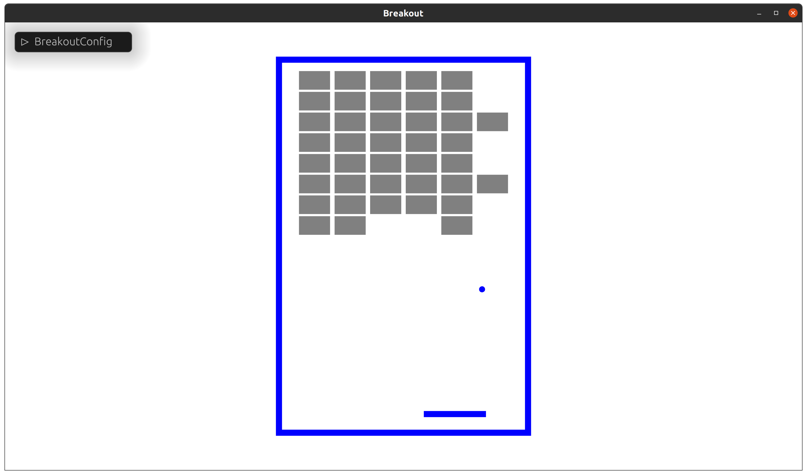

# Bevy Slyedoc Gym

> Not working on this anymore! Was first time using rapier and dont know enough do this well.  Only leaving this up as a ref for myself.

- [Bevy Slyedoc Gym](#bevy-slyedoc-gym)
  - [Design](#design)
  - [Getting started](#getting-started)
  - [Overview](#overview)
  - [Environments](#environments)
    - [Games](#games)
    - [Classical](#classical)
  - [Debugging](#debugging)
  - [Resources](#resources)

For now this is playground as I figure out how I can use Bevy and rust to do some reinforcement learning, though I am a novice of both.

While python is king the the machine learning world, its really the libraries that keep it there, and I think we can do better in rust in the long run.

## Design

Evolving, trying different things nearly ever environment.

## Getting started

```cargo run --release```

You can so start in specified environments with command line arguments, see:

```cargo run --release -- --help```

I use cargo watch for a fast development cycle, example command:

```bash
cargo watch --clear -x "run --release -- -e flappy -h"
```

## Overview

Tch-rs - is not thread safe, we have to limit bevy in how it can access tch-rs
Will be using bevy non_send resources and [exclusive_system](https://github.com/bevyengine/bevy/blob/main/examples/ecs/ecs_guide.rs)

## Environments

Below are the current environments, still work in progress.  Will try to mark the models currently working with each.

### Games

- Breakout (human)

- Flappy Bird (human, neat) - in progress


### Classical

- Acrobot (human)
- Cartpole (human, pg)
- Mountain Car - in progress, forked bevy_rapier and added support for polyline debug rendering for the ground, still need to work on the car
- Pendulum (human)

## Debugging

While tch-rs works out of the box, if you want to attach a debugger it takes a bit more setup.

See [libtorch setup](https://github.com/LaurentMazare/tch-rs#libtorch-manual-install), that will lead you to [pytorch](https://pytorch.org/get-started/locally/)

Download whatever version you need, for myself I wanted cuda 11.1 support so:

Stable (1.9.0) > Linux > LibTorch > C++/Java > CUDA 11.1

If your new to setting up CUDA, off to google with you, your going to be gone a while, good luck!

You will need to set LIBTORCH env var otherwise tch-rs will download a precompiled version.

This is my setup.

```bash
export LD_LIBRARY_PATH=/usr/local/cuda/lib64:/usr/local/cuda/extras/CUPTI/lib64
export LIBTORCH=/{YOUR-PATH}/libtorch-cxx11-abi-shared-with-deps-1.9.0+cu111/libtorch
export LD_LIBRARY_PATH=${LIBTORCH}/lib:$LD_LIBRARY_PATH
export TORCH_CUDA_VERSION="cu111"
```

## Resources

- [Bevy](https://github.com/bevyengine/bevy)
- [Torch - A GPU-Ready Tensor Library](https://github.com/pytorch/pytorch#from-source)
- [NVidia Cuda 11.1](https://developer.nvidia.com/cuda-11.1.0-download-archive?target_os=Linux&target_arch=x86_64&target_distro=Ubuntu&target_version=2004&target_type=deblocal)
